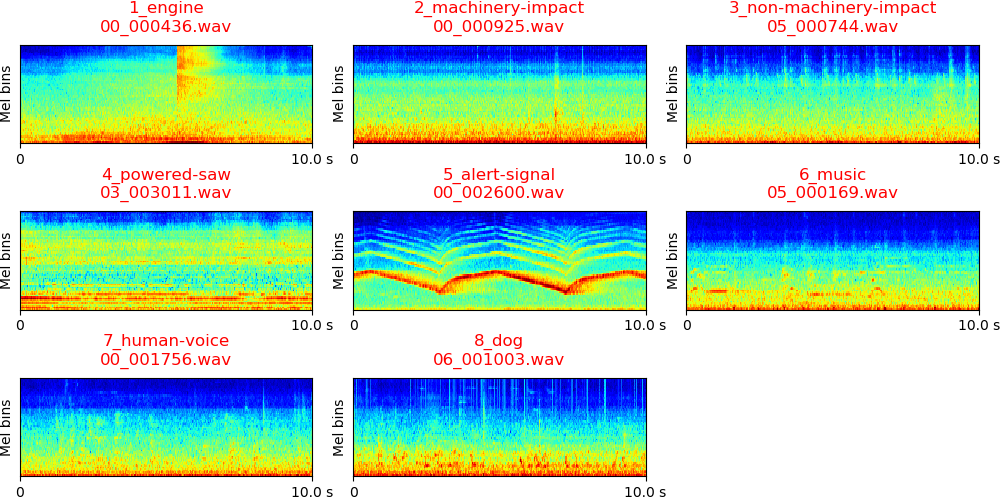

# DCASE2019 Task5 Urban Sound Tagging

DCASE2019 Task5 Urban Sound Tagging is a task to predict tags of audio recordings recorded from urban acoustic sensors. The task includes a fine-grained classification of 23 sound classes and a coarse-grained classification 8 sound classes. More description of this task can be found in http://dcase.community/challenge2019/task-urban-sound-tagging. 

## DATASET
The dataset can be downloaded from http://dcase.community/challenge2019/task-urban-sound-tagging. Each audio recording is monophonic, 10-second in length, and with a sample rate of 44.1 kHz. The statistic of the data is shown below:

|      | Train | Validate | Evaluation |
|:----:|:-----:|:--------:|:----------:|
| Num. |  2351 |    443   |      -     |

The log mel spectrogram of audio recordings are shown below (audios from validate folder):

## Run the code

**0. Prepare data** 

Download and upzip data, the data looks like:

<pre>
dataset_root
├── train (2351 files)
|    ├── 01_000006.wav
│    └── ...
├── validate (443 files)
|    ├── 00_000066.wav
│    └── ...
├── annotations.csv
├── dcase-ust-taxonomy.yaml
└── ...
</pre>

**1. Requirements** 

python 3.6 + pytorch 1.0

**2. Then simply run:**

$ Run the bash script ./runme.sh

Or run the commands in runme.sh line by line. The commands includes:

(1) Modify the paths of dataset and your workspace

(2) Extract features

(3) Train model

(4) Inference

## Model
We apply convolutional neural networks using the log mel spectrogram audio as input. The outputs represents the presence probability of sound classes. To train a CNN with 9 layers and a mini-batch size of 32, the training takes approximately 200 ms / iteration on a single card GTX Titan Xp GPU. The model is trained for 5000 iterations. The training looks like:

<pre>
Load data time: 2.499 s
Training audio num: 2351
Validation audio num: 443
------------------------------------
...
------------------------------------
Iteration: 5000
train mAP: 1.000
validate mAP: 0.360
Train time: 39.336 s, validate time: 5.301 s
Model saved to /vol/vssp/msos/qk/workspaces/dcase2019_task5/models/main/logmel_64frames_64melbins/taxonomy_level=fine/holdout_fold=1/md_5000_iters.pth
------------------------------------
...
</pre>

## Results

|     | Fine classes mAP | Coarse classes mAP |
|:---:|:----------------:|:------------------:|
| mAP |       0.360      |        0.534       |

## Summary
This codebase provides a convolutional neural network (CNN) for DCASE2019 Task5 Urban Sound Tagging. 

## Citation
To appear. 

## FAQ
If you met running out of GPU memory error, then try to reduce batch_size. 

## External link

The official baseline system implemented using Keras can be found in https://github.com/sharathadavanne/seld-dcase2019
